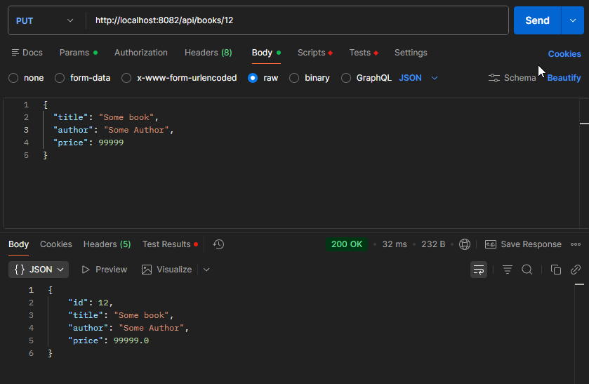
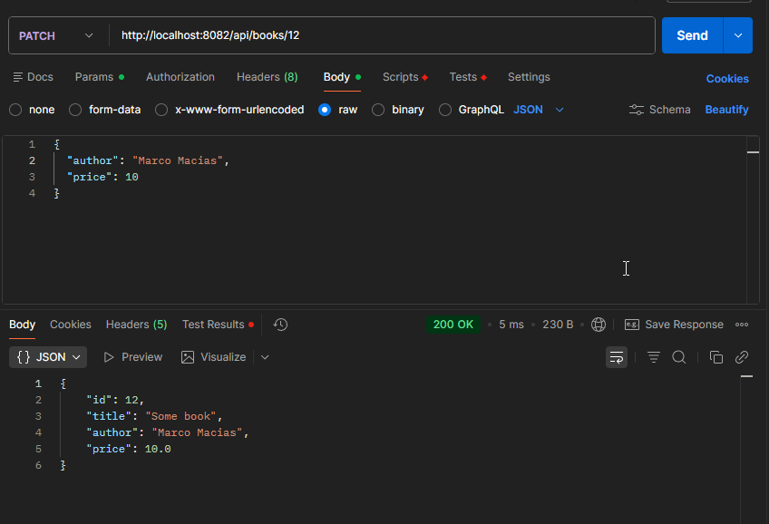
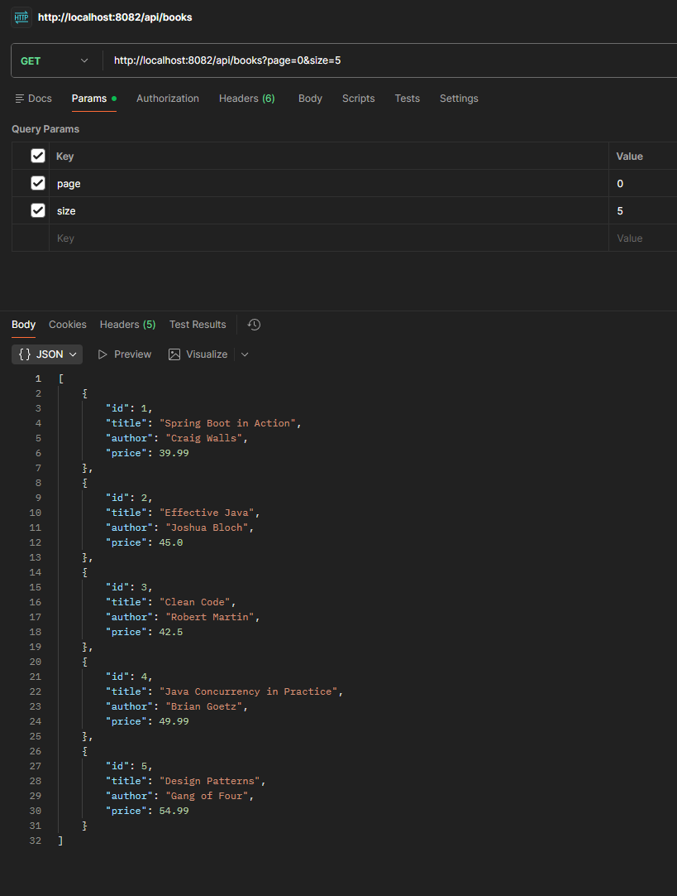
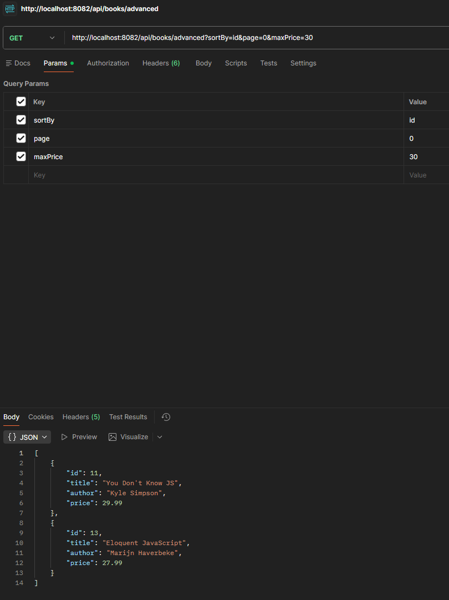

# CPSC-449-HW1

## PUT – Update Book

**Endpoint**
```
PUT /books/{id}
```

**Description**  
Replaces the entire book with new values.

**Example Request**
```
PUT http://localhost:8082/api/books/3
```

**Request Body (JSON)**
```json
{
  "title": "Updated Title",
  "author": "Updated Author",
  "price": 49.99
}
```

### Result


---

## PATCH – Partial Update

**Endpoint**
```
PATCH /books/{id}
```

**Description**  
Updates only the fields provided in the request body.  
Fields not included remain unchanged.

**Example Request**
```
PATCH http://localhost:8082/api/books/3
```

**Request Body (JSON)**
```json
{
  "price": 29.99
}
```

### Result


---

## DELETE – Remove Book

**Endpoint**
```
DELETE /books/{id}
```

**Description**  
Removes a book by ID.

**Example Request**
```
DELETE http://localhost:8082/api/books/3
```

### Result


---

## GET – Pagination

**Endpoint**
```
GET /books?page=0&size=5
```

**Description**  
Returns books using pagination.

**Query Parameters**
- `page` → Page number (default: 0)
- `size` → Number of items per page (default: 5)

**Example Request**
```
GET http://localhost:8082/api/books?page=1&size=5
```

### Result


---

## Advanced GET – Filtering, Sorting, Pagination

**Endpoint**
```
GET /books/advanced
```

**Description**  
Applies filtering → sorting → pagination in this order.

### Optional Query Parameters
- `title`
- `author`
- `minPrice`
- `maxPrice`
- `minPages`
- `maxPages`
- `sortBy` → `id`, `title`, `author`, `price`
- `sortDir` → `asc`, `desc`
- `page`
- `size`

**Example Request**
```
GET http://localhost:8082/api/books/advanced?title=java&minPrice=30&sortBy=price&sortDir=asc&page=0&size=5
```

### Result


---

